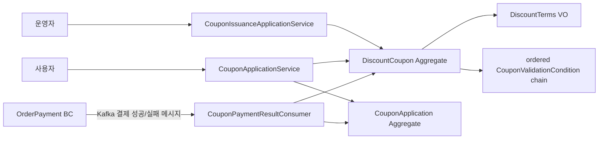

# DDD Architecture

## Entity / Value Objects

| 구분 | 이름 | 속성 | 타입 | 필수 여부 |
| --- | --- | --- | --- | --- |
| Entity | DiscountCoupon | couponId, ownerUserId, discountTerms, validationConditions, usageStatus | CouponId, UserId, DiscountTerms, List&lt;CouponValidationCondition&gt;, CouponUsageStatus | 모두 필수 |
| Entity | CouponApplication | couponApplicationId, couponId, orderId, appliedDiscountAmount, applicationStatus | CouponApplicationId, CouponId, OrderId, Money, CouponApplicationStatus | 모두 필수 |
| VO | CouponId | 값 | UUID | 필수 |
| VO | CouponApplicationId | 값 | UUID | 필수 |
| VO | UserId | 값 | UUID | 필수 |
| VO | OrderId | 값 | UUID | 필수 |
| VO | DiscountTerms | discountType, discountValue, maximumDiscountAmount | DiscountType, Money, Money | 모두 필수 |
| Entity (추상) | CouponValidationCondition | conditionId, evaluationOrder, conditionType | CouponValidationConditionId, Integer, CouponValidationConditionType | 모두 필수; DiscountCoupon 내부 소유·영속 컬렉션 |
| Entity | CouponOwnerCondition | conditionId, evaluationOrder | CouponValidationConditionId, Integer | 필수 |
| Entity | CouponValidityPeriodCondition | conditionId, evaluationOrder, validFrom, validUntil | CouponValidationConditionId, Integer, Instant, Instant | 필수 |
| Entity | CouponUsageStatusCondition | conditionId, evaluationOrder | CouponValidationConditionId, Integer | 필수 |
| Entity | MinimumOrderAmountCondition | conditionId, evaluationOrder, minimumOrderAmount | CouponValidationConditionId, Integer, Money | 필수 |
| VO | CouponValidationContext | couponOwnerUserId, applyingUserId, orderAmount, occurredAt, couponUsageStatus | UserId, UserId, Money, Instant, CouponUsageStatus | 모두 필수 |
| VO | CouponValidationFailure | failedConditionType, reasonCode | CouponValidationConditionType, CouponValidationFailureReason | 실패 시 필수 |
| VO | CouponValidationResult | success 또는 failure | Boolean, CouponValidationFailure | success면 failure 없음, failure면 failure 필수 |
| VO | Money | amount | BigDecimal | 필수 |
| VO | DiscountType | 값 | FIXED_AMOUNT 또는 PERCENTAGE | 필수 |
| VO | CouponUsageStatus | 값 | AVAILABLE, TEMPORARILY_APPLIED, USED | 필수 |
| VO | CouponApplicationStatus | 값 | TEMPORARILY_APPLIED, USED, RESTORED | 필수 |

## Behaviors / Application Service Flow

### Behaviors

| 소유자 | 메서드 | 입력 | 결과 |
| --- | --- | --- | --- |
| DiscountCoupon | issue | couponId, ownerUserId, discountTerms, validationConditions | 대상 사용자·할인 정책·순서가 지정된 검증 조건을 가진 AVAILABLE 쿠폰을 생성한다. |
| DiscountCoupon | validateFor | CouponValidationContext | evaluationOrder 오름차순으로 validationConditions를 체이닝 평가하고 첫 실패 결과를 반환한다. |
| DiscountCoupon | temporarilyApply | userId, orderId, orderAmount, now | CouponValidationContext를 만들고 validationConditions를 evaluationOrder 오름차순으로 체이닝 평가한다. 첫 실패는 CouponValidationFailure를 반환하고, 모두 성공하면 할인액을 계산한 뒤 TEMPORARILY_APPLIED로 변경한다. |
| CouponValidationCondition | evaluate | CouponValidationContext | 조건 충족 시 success, 불충족 시 자신의 conditionType·reasonCode를 담은 failure를 반환한다. DiscountCoupon은 success일 때만 다음 조건을 평가한다. |
| DiscountTerms | calculateDiscount | orderAmount | 정액 또는 정률 할인을 계산하고, 정률 할인은 maximumDiscountAmount를 넘지 않게 한다. |
| CouponApplication | recordTemporaryApplication | couponApplicationId, couponId, orderId, appliedDiscountAmount | 주문 ID와 임시 적용 할인액을 연결한 TEMPORARILY_APPLIED 적용 기록을 생성한다. |
| DiscountCoupon | markUsed | 없음 | TEMPORARILY_APPLIED 쿠폰을 USED 상태로 변경한다. |
| CouponApplication | markUsed | 없음 | TEMPORARILY_APPLIED 적용 기록을 USED 상태로 변경한다. |
| DiscountCoupon | restore | 없음 | TEMPORARILY_APPLIED 쿠폰을 AVAILABLE 상태로 복구한다. |
| CouponApplication | restore | 없음 | TEMPORARILY_APPLIED 적용 기록을 RESTORED 상태로 변경한다. |

### Application Service Flow

| 서비스 | 메서드 | 호출 흐름 |
| --- | --- | --- |
| CouponIssuanceApplicationService | issueCoupon | DiscountCoupon.issue → DiscountCouponRepository.save |
| CouponApplicationService | applyToOrder | DiscountCouponRepository.findById → DiscountCoupon.temporarilyApply(ordered validation chain) → CouponApplication.recordTemporaryApplication → DiscountCouponRepository.save + CouponApplicationRepository.save |
| CouponPaymentResultConsumer | handlePaymentSucceeded | Kafka 결제성공 이벤트 수신 → CouponApplicationRepository.findByOrderId → DiscountCouponRepository.findById → DiscountCoupon.markUsed + CouponApplication.markUsed → 두 Repository.save |
| CouponPaymentResultConsumer | handlePaymentFailed | Kafka 결제실패 이벤트 수신 → CouponApplicationRepository.findByOrderId → DiscountCouponRepository.findById → DiscountCoupon.restore + CouponApplication.restore → 두 Repository.save |

## Aggregates

| 어그리거트 이름 | 루트 어그리거트 엔티티 | 구성요소 |
| --- | --- | --- |
| DiscountCoupon | DiscountCoupon | CouponId, UserId, DiscountTerms, CouponUsageStatus, CouponValidationCondition 영속 컬렉션(상속 discriminator + evaluationOrder) |
| CouponApplication | CouponApplication | CouponApplicationId, CouponId 참조, OrderId 참조, Money, CouponApplicationStatus |

## Bounded Contexts / BC 간 커뮤니케이션

| BC 이름 | 소유 어그리거트 | 통신 대상 BC | 통신 방식 |
| --- | --- | --- | --- |
| Coupon | DiscountCoupon, CouponApplication | OrderPayment | domain_event |
| OrderPayment | 없음 | Coupon | domain_event (Kafka 결제 성공/실패 메시지) |

## Mermaid Graph

