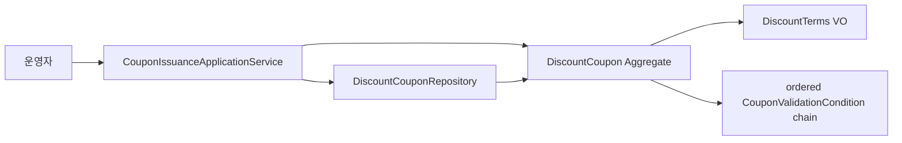

# UC-001. DDD 후보 설계

## Entity / Value Objects

| 구분 | 이름 | 속성 | 타입 | 필수 여부 |
| --- | --- | --- | --- | --- |
| Entity | DiscountCoupon | couponId, ownerUserId, discountTerms, validationConditions, usageStatus | CouponId, UserId, DiscountTerms, List&lt;CouponValidationCondition&gt;, CouponUsageStatus | 모두 필수 |
| VO | CouponId | 값 | UUID | 필수 |
| VO | UserId | 값 | UUID | 필수 |
| VO | DiscountTerms | discountType, discountValue, maximumDiscountAmount | DiscountType, Money, Money | 모두 필수 |
| Entity (추상) | CouponValidationCondition | conditionId, evaluationOrder, conditionType | CouponValidationConditionId, Integer, CouponValidationConditionType | 모두 필수; DiscountCoupon 내부 소유·영속 컬렉션 |
| Entity | CouponOwnerCondition | conditionId, evaluationOrder | CouponValidationConditionId, Integer | 필수 |
| Entity | CouponValidityPeriodCondition | conditionId, evaluationOrder, validFrom, validUntil | CouponValidationConditionId, Integer, Instant, Instant | 필수 |
| Entity | CouponUsageStatusCondition | conditionId, evaluationOrder | CouponValidationConditionId, Integer | 필수 |
| Entity | MinimumOrderAmountCondition | conditionId, evaluationOrder, minimumOrderAmount | CouponValidationConditionId, Integer, Money | 필수 |
| VO | Money | amount | BigDecimal | 필수 |
| VO | DiscountType | 값 | FIXED_AMOUNT 또는 PERCENTAGE | 필수 |
| VO | CouponUsageStatus | 값 | AVAILABLE, TEMPORARILY_APPLIED, USED | 필수 |

## Behaviors / Application Service Flow

### Behaviors

| 소유자 | 메서드 | 입력 | 결과 |
| --- | --- | --- | --- |
| DiscountCoupon | issue | couponId, ownerUserId, discountTerms, validationConditions | 대상 사용자·할인 정책·순서가 지정된 검증 조건을 가진 AVAILABLE 쿠폰을 생성한다. |
| DiscountCoupon | validateFor | CouponValidationContext | evaluationOrder 오름차순으로 validationConditions를 체이닝 평가하고 첫 실패 결과를 반환한다. |
| CouponValidationCondition | evaluate | CouponValidationContext | 성공이면 다음 조건으로, 실패면 CouponValidationFailure를 반환한다. |

### Application Service Flow

| 서비스 | 메서드 | 호출 흐름 |
| --- | --- | --- |
| CouponIssuanceApplicationService | issueCoupon | DiscountCoupon.issue → DiscountCouponRepository.save |

## Aggregates

| 어그리거트 이름 | 루트 어그리거트 엔티티 | 구성요소 |
| --- | --- | --- |
| DiscountCoupon | DiscountCoupon | CouponId, UserId, DiscountTerms, CouponUsageStatus, CouponValidationCondition 영속 컬렉션(상속 discriminator + evaluationOrder) |

## Bounded Contexts / BC 간 커뮤니케이션

| BC 이름 | 소유 어그리거트 | 통신 대상 BC | 통신 방식 |
| --- | --- | --- | --- |
| Coupon | DiscountCoupon | 없음 | 없음 |

## Mermaid Graph

<!-- harness:ddd-visualization:start -->

<!-- harness:ddd-visualization:end -->
